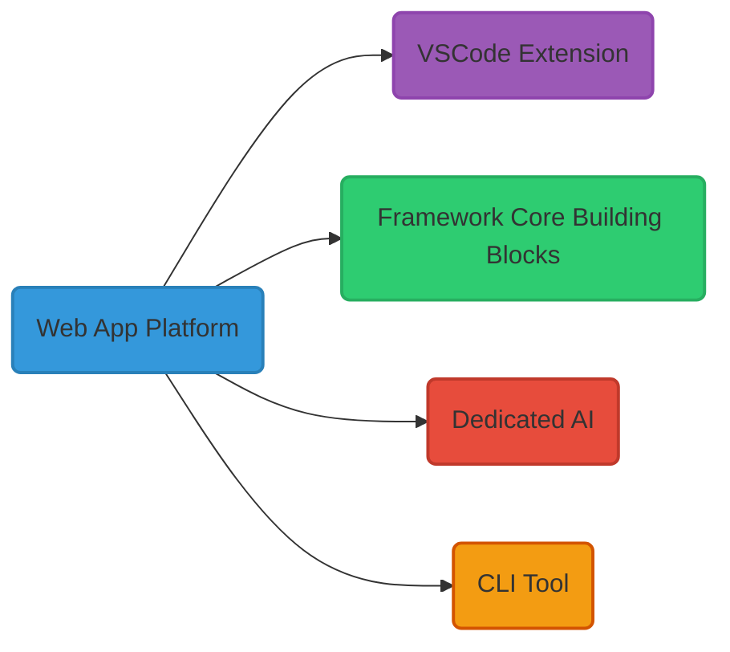
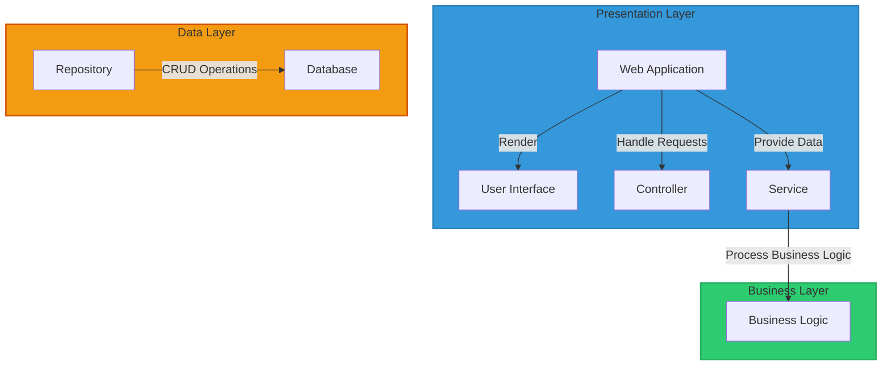
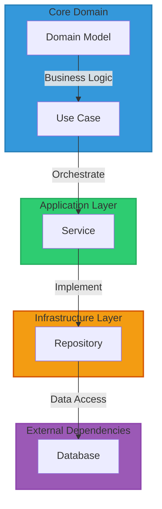
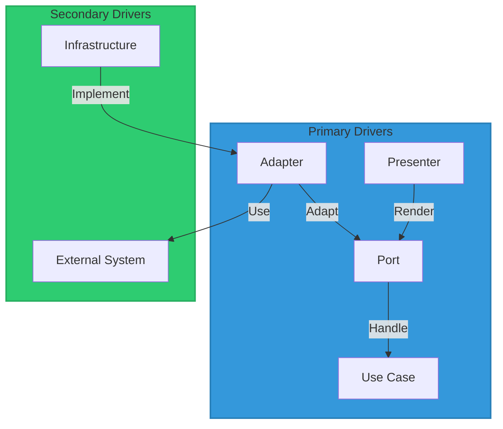
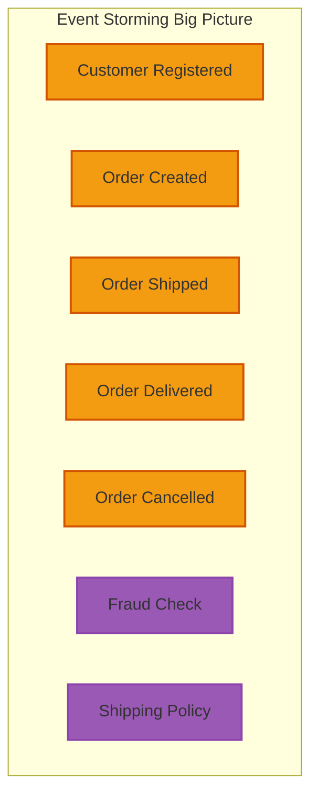
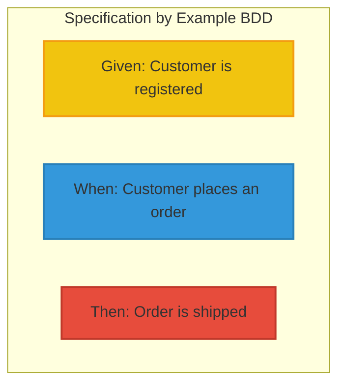

# odeev-kata

Welcome to the Odeev kata Challenge Solution Proposal Repository, Kata description here [Odeev Kata](https://katasintegraodeev.notion.site/KATA-Sintegra-Odeev-70ca32a01bd44ab59a97956095f3dd70), 
this repository will serve as an exploration logs, will go over the overall solution discovery, 
enumerating the different challenges, solutions options and trade-off.\
Also will try to deliver the architecture and a working PoC of the solution, plus the supported architecture and 
practices that can be applied to the generated solutions project.
Will try to present a Pragmatic and Evolutionary Solution Architecture, from integrating with existing tools, 
custom Web App Tool, IDE Extension like (VSCode, JetBrains IDEs), console CLI commands tool.

# IMPORTANT NOTE: Having Fun :) !!

## Table of Content

## Introduction
The solution is sort of integrated platform designed to provide a comprehensive development environment for building 
and deploying software applications. 
It encompasses several key components, including a Web App Platform, specific Framework Building Blocks (Core, Abstraction, Code Generator), 
a dedicated AI with models trained on the solution's core code, a Visual Studio Code extension, and a command-line interface (CLI) tool.

One of the key features of the solution is its ability to support a wide range of target platforms, 
including JVM, .NET, Web, Mobile, and Desktop. Each target platform may have different architecture styles and patterns,
concurrency models, and other unique characteristics.

The Web App Platform offers a robust framework for building web applications, providing tools and libraries 
for Architecture & Model diagrams & Diagram as Code, Collaboration around Business Requirements, front-end development, 
back-end logic, database integration, and deployment.

The Specific Framework Building Blocks encompass three core components: Core, Abstraction, and Code Generator. 
The Core component serves as the foundation, offering essential functionalities like dependency injection, 
configuration management, and logging. Abstraction abstracts away low-level implementation details, 
providing a unified interface for interaction. Code Generator automates repetitive tasks by generating boilerplate code 
and configuration files based on predefined templates. 
Together, these components streamline development, enhance productivity, and maintain consistency across projects.

The dedicated AI component leverages machine learning algorithms trained on the solution's core codebase to provide intelligent assistance to developers. 
This includes features such as Architecture Model assistance, code completion, error detection, automated refactoring suggestions and migrations.

The Visual Studio Code extension enhances the development experience by integrating seamlessly with the popular code editor. 
It provides additional functionalities, such as code navigation, debugging support, and integration with version control systems.

The command-line interface (CLI) tool offers a convenient way to interact with the solution from the terminal. 
It allows developers to perform various tasks, such as project scaffolding, dependency management, and deployment, all from the command line.

## Solution Overview

## Generated Solutions Overview
- Classic Layered Architecture

- Onion / Clean Architecture

- Port & Adapter

## Architecture & Modeling
The platform provide a comprehensive suite of modeling and diagramming tools, augmented by AI capabilities. 
These tools empower teams to visualize complex systems, design intricate architectures, and map out intricate workflows with ease. 
Leveraging AI assistance, the platform offers intelligent suggestions, automates repetitive tasks, and assists in decision-making processes. 

Furthermore, the platform fosters enhanced collaboration among team members by facilitating real-time collaboration, version control, and feedback mechanisms. 
Whether adopting a top-down or bottom-up approach to design, the platform provides robust support, enabling teams to iterate quickly, refine designs iteratively, 
and align architectural decisions with business objectives effectively and normalize the code generation process.

### Bottom Up Domain Modeling

### Top Down APIs Modeling
using APIs design first by writing the Open API Specification yml file and use tool like Swagger to preview the APIs and Swagger code generation to generate the APIs

### Inspired By Existing tools:

The platform's key feature lies in its ability to consolidate and integrate existing tools from the market into one centralized location. 
By leveraging the strengths of various established tools across different domains, users can access a comprehensive suite of functionalities within a single platform. 
This approach eliminates the need for users to navigate through multiple applications or switch between different tools, saving time and streamlining workflows.

Whether it's IDEs, project management software, collaboration platforms, or modeling tools, the platform brings together the best features from existing tools, 
providing users with a unified solution that meets their diverse needs. 
By offering a one-stop-shop for essential tools and functionalities, the platform enhances user productivity, fosters collaboration,
and simplifies the development process.
### Web
- https://domorobo.to/
- https://prooph-board.com/
- https://www.modelmycode.com/

### VSCode Extension
- OpenAPI Spec Swagger
- Draw.io

## Dedicated AI for Design & Code Generation

The platform incorporates a dedicated AI system specifically tailored for design and code generation tasks. 
This AI functionality serves as a powerful assistant to developers, architects, and designers, providing intelligent insights and automating repetitive tasks. 
Users have the option to leverage both private and locally trained AI models, as well as publicly available AI services, 
depending on their specific requirements and preferences.

Private and locally trained AI models offer several advantages, including enhanced privacy and security for sensitive data and projects. 
By training AI models on proprietary datasets and project-specific contexts, users can fine-tune the AI's capabilities 
to better align with their unique needs and domain-specific challenges. 
Additionally, local AI models provide greater control over the training process and enable users to iterate 
and refine their models based on real-world feedback and insights.
## PoC
### Overview

### Architecture Decisions Records

